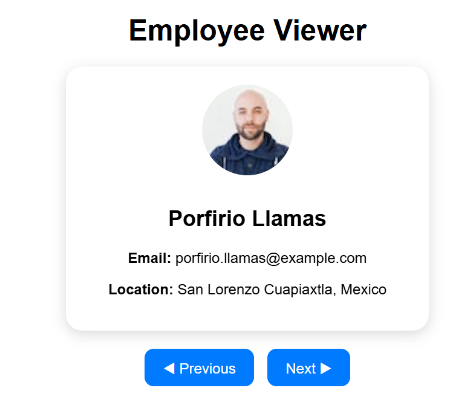

# Employee Viewer

A React application built with Vite to display random users in a **stylish employee card** format.

Each user shows: photo, name, email, and location. Navigation between users has a **page-flip animation**, and the buttons are automatically disabled at the first and last users.

---

## ⚡ Technologies

- React + TypeScript
- Vite
- Pure CSS
- API: [Random User Generator](https://randomuser.me/)

---

## 📂 Project Structure

tutorial/
├─ src/
│ ├─ App.tsx
│ ├─ style.css
│ └─ main.tsx
├─ index.html
├─ package.json
└─ tsconfig.json

## Picture

